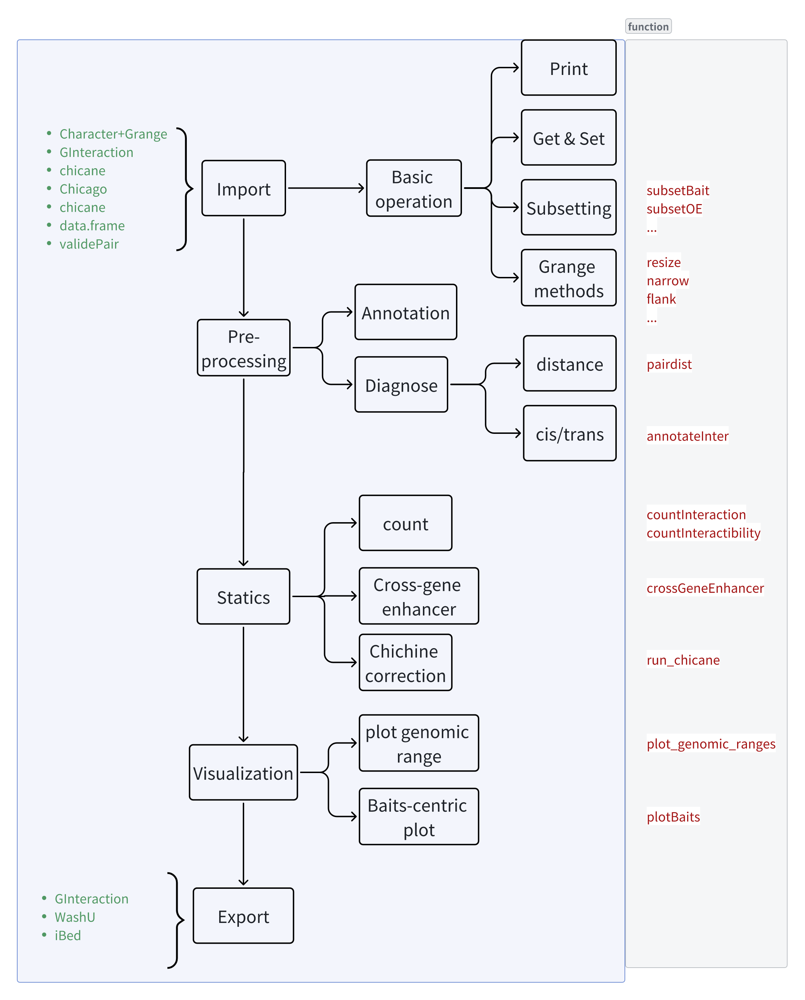
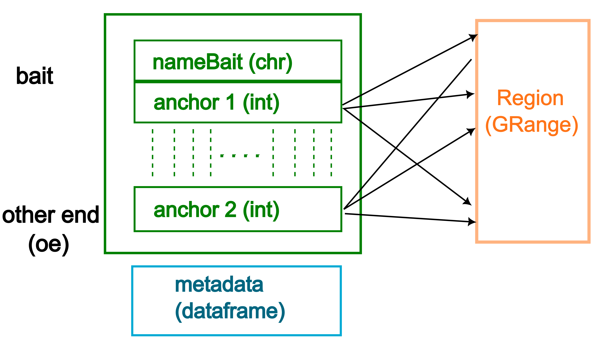
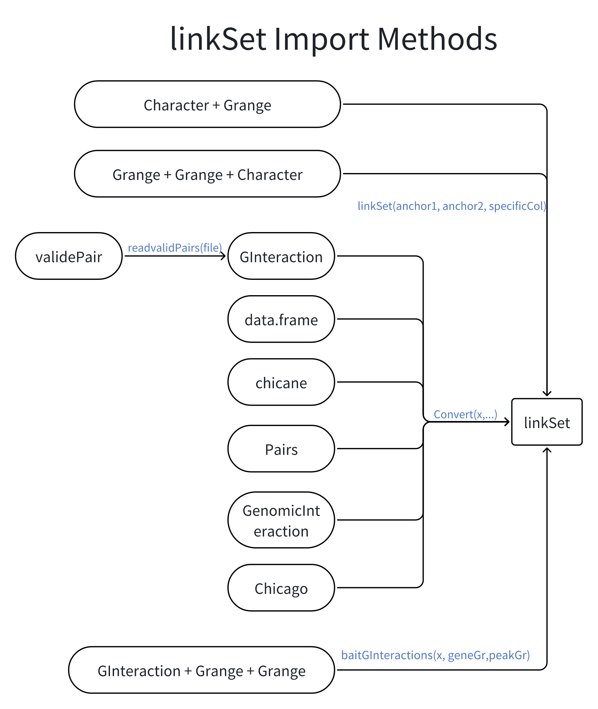

```{r, include = FALSE}
knitr::opts_chunk$set(
  collapse = TRUE,
  comment = "#>"
)
```

## Introduction
With techniche like HiC, PCHiC, scATAC-seq, and other high-throughput omics techniques, 
we are able to predict the interactions between genes and enhancers. The linkSet package provides classes to
represent the interactions between genes and enhancers, and provides functions to analyze and visualize the interactions.

## Application Situation
linkSet can seamlessly apply to the following situation:
1. Capture HiC workflow.
2. Using HiC to identify gene-enhancer interactions.
3. Using scRNA and scATAC to predict gene-enhancer interactions.

## The linkSet class
The linkSet class is a specialized data structure designed to represent and analyze genomic interactions, 
particularly focusing on gene-enhancer relationships. It's part of the linkSet package, 
which provides tools for managing and analyzing genomic link data in bioinformatics and genomic research.

Key features of the linkSet class: 

1. Representation of genomic interactions:
- It stores two types of genomic anchors: "bait" (typically genes) and "other end" (oe, typically enhancers or other regulatory elements).
- These anchors are represented as genomic ranges, allowing for precise localization on chromosomes.
2. Flexible input:
Can be constructed from various data types, including GRanges objects for both anchors, or character vectors for bait and GRanges for other ends.
Supports conversion from other common genomic data structures like GInteractions and data frames.
3. Metadata storage:
Allows for additional information to be stored alongside the genomic interactions, such as interaction scores or experimental conditions.
4. Biological context:
Designed to work with data from various high-throughput genomic techniques like Hi-C, Promoter Capture Hi-C (PCHi-C), and scATAC-seq.
Facilitates the analysis of long-range chromatin interactions, which are crucial for understanding gene regulation and 3D genome organization.
5. Annotation capabilities:
Includes methods for annotating promoters and distinguishing between inter- and intra-chromosomal interactions.
This feature is particularly useful for identifying potential regulatory relationships between distal genomic elements.
6. Integration with Bioconductor:
Built on top of established Bioconductor classes, ensuring compatibility with a wide range of genomic analysis tools.
7. Visualization and analysis:
The class is designed to support functions for analyzing and visualizing genomic interactions.

```{r out.width = '70%', echo = FALSE, fig.alt="Overview diagram of the linkSet class structure and its components"}
knitr::include_graphics("img/overview.png")
```


```{r out.width = '80%', echo = FALSE, fig.alt="Overview diagram of the linkSet methods"}

```

## Construction
The linkSet class can be constructed from various data types, including GRanges objects for both anchors, or character vectors for bait and GRanges for other ends.
```{r out.width = '70%', echo = FALSE, fig.alt="data structure of the linkSet class"}

```


```{r out.width = '70%', echo = FALSE, fig.alt="Import methods"}

```

### Construction from GRanges objects

To construct a `linkSet` object from GRanges objects:
```{r setup}
suppressPackageStartupMessages(library(linkSet))
```
```{r}
library(GenomicRanges)
gr1 <- GRanges(seqnames = c("chr1", "chr1", "chr2"),
              ranges = IRanges(start = c(1, 100, 200), width = 10),
              strand = "+", symbol = c("Gene1", "Gene2", "Gene3"))
gr2 <- GRanges(seqnames = c("chr1", "chr2", "chr2"),
              ranges = IRanges(start = c(50, 150, 250), width = 10),
              strand = "+")
## construct linkSet
ls <- linkSet(gr1, gr2, specificCol = "symbol")
ls

```

### Construction from GInteractions
You can also create a `linkSet` object from a `GInteractions` object using the `Convert` function:

```{r}
library(InteractionSet)
gi <- GInteractions(
  anchor1 = c(1, 3, 5),
  anchor2 = c(2, 4, 6),
  regions = GRanges(
    seqnames = c("chr1", "chr1", "chr2", "chr2", "chr3", "chr3"),
    ranges = IRanges(start = c(1, 50, 100, 150, 200, 250), width = 10)
    )
  )
mcols(gi)$score <- c(0.1, 0.2, 0.3)
mcols(gi)$gene <- c("Sox2", "Sox9", "Sox10")
##Convert to linkSet
ls_from_gi <- Convert(gi, baitCol = "gene")
ls_from_gi
```

Some times, you need to use gene and enhancer information to construct a `linkSet` object from GInteractions.

```{r}
geneGr <- GRanges(
  seqnames = c("chr1", "chr2", "chr3"),
  ranges = IRanges(start = c(5, 105, 205), width = 20),
  symbol = c("Gene1", "Gene2", "Gene3")
)

peakGr <- GRanges(
  seqnames = c("chr1", "chr2", "chr3"),
  ranges = IRanges(start = c(45, 145, 245), width = 10)
)

# Run baitGInteractions
ls_from_gi_2 <- baitGInteractions(gi, geneGr, peakGr, geneSymbol = "symbol")

ls_from_gi_2

```

### Other construction methods
You can also construct a `linkSet` object from a data frame.
```{r}
test_df <- data.frame(
  gene = c("gene1", "gene2", "gene3"),
  peak = c("chr1:1000-2000", "chr2:3000-4000", "chr3:5000-6000"),
  score = c(0.5, 0.7, 0.9),
  stringsAsFactors = FALSE
)

# Test successful conversion
ls_from_df <- Convert(test_df)
ls_from_df
```


## Accessors
### Getters
The important elements of the `linkSet` object can be easily accessed by the following accessors:

- `regions(x)`: Get the regions of the `linkSet` object.
- `bait(x)`: Get the bait of the `linkSet` object.
- `oe(x)`: Get the other end of the `linkSet` object.
- `regionsBait(x)`: Get the bait regions of the `linkSet` object.
- `regionsOe(x)`: Get the other end regions of the `linkSet` object.
- `mcols(x)`: Get the metadata of the `linkSet` object.

```{r}
linkSet::regions(ls)
```

```{r}
regionsBait(ls)
```

```{r}
oe(ls)
```

```{r}
bait(ls)
```
```{r}
mcols(ls)
```


### Setters
Wait... You set wrong bait or oe region? You can also change it easily:

```{r}
new_bait <- c("Gene40","Gene41","Gene42")
new_oe <- GRanges(
  seqnames = c("chr1", "chr2", "chr3"),
  ranges = IRanges(start = c(5, 105, 205), width = 20),
  symbol = c("Gene1", "Gene2", "Gene3")
)
bait(ls) <- new_bait
oe(ls) <- new_oe
ls
```


## Subsetting and concatenation
LinkSet object can be easily subsetted by index.
```{r}
ls_sub <- ls[1:2]
ls_sub
```

If you are interested in a specific gene or region, you can subset the `linkSet` object by the bait or oe region.
```{r}
ls_sub_2 <- subsetBait(ls, "Gene1")
ls_sub_2
ls_sub_3 <- subsetBaitRegion(ls, "chr1:100-200")
ls_sub_3
```

You can also concatenate two `linkSet` objects.
```{r}
ls_concat <- c(ls, ls)
ls_concat
```

## GRanges method
The features of linkSet is inherited from GRanges, which means you can use all the functions in GRanges to manipulate the linkSet object.
The most wonderful things is that you can change the bait region and oe region separately.

```{r}
data(linkExample)
linkExample

## resize the bait region
resize_bait <- resizeRegions(linkExample, width = 75, fix = "start", region = "bait")
resize_bait

## resize the oe region
resize_oe <- resizeRegions(linkExample, width = 75, fix = "start", region = "oe")
resize_oe
```

The `reduce` method allows the `linkSet` objects to be collapsed across the whole of the `linkSet` object. 

```{r}
reduce_ls <- reduce(ls_concat)
reduce_ls
```
By default, we will collapse the duplicate interactions, and count the interactions and store in the metadata columns.
You can also choose not to count the interactions by set `countInteractions = FALSE`.

```{r}
reduce_ls_2 <- linkSet::reduceRegions(ls_concat, countInteractions = FALSE)
reduce_ls_2
```

## Diagnose
There are two metrics to diagnose the quality of the `linkSet` object:
1. The intra/inter-chromosomal interactions.
2. The distance between the bait and oe region.

The `diagnose` function can help you to diagnose the `linkSet` object.

```{r}
diagnoseLinkSet(linkExample)
```

```{r}
ls_concat
```
The annotated distance and interaction type is shown in the `distance` and `inter_type` column.

You can remove the intrachromosomal interactions by:
```{r}
ls_concat <- filterLinks(ls_concat, filter_intra = TRUE)
ls_concat
```


## Annotations
It might be common that you only have the bait name, but don't have the exact bait region.
The annotation function can help you to annotate the bait region from a gene annotation.

```{r}
bait <- c("BRCA1", "TP53", "NONEXISTENT")
gr2 <- GRanges(seqnames = c("chr1", "chr2", "chr3"),
                ranges = IRanges(start = c(5000, 6000, 7000), width = 100),
                strand = "+")
ls <- linkSet(bait, gr2)

# Test annotatePromoter
annotated_ls <- suppressWarnings(annotatePromoter(ls, genome = "hg38", upstream = 500,overwrite = T))
annotated_ls
```

## Statistical analysis
Functional enhancers usually regulate multiple genes, we can use cross gene analysis to identify the cross gene enhancers.

```{r}
annotated_ls <- crossGeneEnhancer(annotated_ls)
annotated_ls <- orderLinks(annotated_ls,by = "crossFreq",decreasing = T)
annotated_ls
```

linkSet also implement the [`CHiCANE` analysis](https://www.nature.com/articles/s41596-021-00498-1), which can identifying the high-confidence interactions.
**CHiCANE** needs to count interactibility and dist before running the statistical test.
```{r}
annotated_ls <- countInteractibility(annotated_ls)
annotated_ls <- linkSet::pairdist(annotated_ls)
annotated_ls <- run_chicane(annotated_ls)
annotated_ls
```


## Visualization

With `plot_genomic_ranges` function, you can visualize the link between bait and oe region.

You can choose the oe-centric views to visualize the functional enhancer which regulate multiple genes.
```{r}
plot_genomic_ranges(linkExample,extend.base = 10)
```

You can adjust the range of the views.
```{r}
plot_genomic_ranges(linkExample,extend.base = 10,x.range = c(50,200))
```
